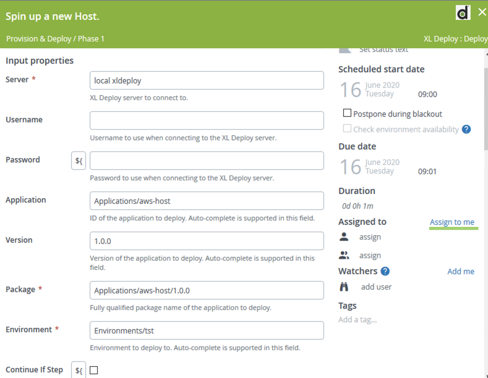

# AWS Workshop

## Setup

on the machine running the XLDeploy Server.

* install [xld-ansible-step-plugin](https://github.com/xebialabs-community/xld-ansible-step-plugin/releases/download/v1.1.0-rc.8/xld-ansible-step-plugin-1.1.0-rc.8.xldp) plugin. Copy the file into $XL_DEPLOY_HOME/plugins directory.
* install [xld-aws-keypair-plugin](./plugins/xld-aws-ec2-keypair-plugin-0.0.3.jar) plugin. Copy the file into $XL_DEPLOY_HOME/plugins directory.
* install [overtherepy](https://github.com/xebialabs-community/overthere-pylib/releases/download/v0.0.4/overtherepy-0.0.4.jar) plugin. Copy the file into $XL_DEPLOY_HOME/plugins directory.
* restart XL Deploy Server
* install [XL-CLI](https://dist.xebialabs.com/public/xl-cli/9.6.2/) depending of the running platform (Linux,Windows or MacOS). Copy the file into $XL_DEPLOY_HOME/xl-cli directory.[Devops As Code Documentation](https://docs.xebialabs.com/v.9.6/xl-release/concept/get-started-with-devops-as-code#get-started)
* Fork or Download this repository. https://github.com/bmoussaud/xl-aws-workshop

## Steps

The workshop will setup the following stack:


### Provision the ansible controlleur in AWS

* apply the Devops-as-code defintions containing the deployment package for ansible controller

```bash
xl apply -f xebialabs/ansible_controler.yaml
```

* edit CI Applications/ansible-controller/1.0.0/ansible-host-template/ansible-controler-template, to modify devops properties to match your current environment (devopsAsCodeUrl & xlPath)
* deploy `Applications/ansible-controller/1.0.0` package in an environment containing an aws.Cloud Configuration item with your AWS credentials.
* Once deployed, in the Infrastructure,a new configuration item representing the Ansible controler has been created and added to the environment. It follows the following pattern 'Infrastructure/ansible-controlleur-{}-host'.

### Provision a new target host in AWS

* apply the Devops-as-code defintions containing the deployment package containing the aws-host package.

```bash
xlw apply -f xebialabs/aws_host.yaml
```

* deploy `Applications/aws-host/1.0.0` package in an environmnet containing an aws.Cloud Configuration item with your AWS credentials.
* Once deployed, in the Infrastructure, a new Configuration representing the new EC2 instance has been created and added to the environment. it follows the following pattern 'Infrastructure/{}-host'.

### Provision tomcat using Ansible

* apply the Devops-as-code defintions containing the deployment package containing the java-server-application package. 

```bash
xlw apply -f xebialabs/application_tomcat.yaml
```

* deploy `Applications/java-server-application/0.1.1` package in the same environment.
* Once deployed, in the Infrastructure, 2 new configuration items representing the new `tomcat server` have been created and added to the environment. It follows the following pattern `Infrastructure/{}-host/tomcat-server` and `Infrastructure/{}-host/tomcat-server/tomcat.vh`

### Deploy the Web application

* Right-click on the `Applications` node, and select `import from XLDeploy Server`
* Select `PetClinic-war/1.0` package and click on the `Import` button
* Right-click on the `Applications` node, and select `import from XLDeploy Server`
* Select `PetClinic-war/2.0` package and click on the `Import` button
* Deploy `Applications/PetClinic-war/1.0` package in the same environment.
* Open a web browser to the `http://%IP_OF_AWS_HOST%/petclinic` address.
* Deploy `Applications/PetClinic-war/2.0` package in the same environment.
* Open a web browser to the `http://%IP_OF_AWS_HOST%/petclinic` address. Check the difference.

### Dump the state

* using the XL command line, you can dump the complete state of
  * the infrastructure `xl generate xl-deploy -p Infrastructure -f infrastructure.yaml`
  * the applications `xlw generate xl-deploy -p Applications -f app.yaml`
  * the environments `xlw generate xl-deploy -p Environments -f env.yaml`


### Undeploy (TODO)

* TODO

### Orchestration - phase 1

in XLRelease, we'll design a template to orchestrate the tasks to provision and to deploy a full stack.

* Click in Design and add a folder `MyApp`
* Click on the `Configuration` Tab and add an `XLDeploy Server`
  * title : local xldeploy
  * url: http://localhost:4516
  * authentication method: `basic`
  * provider username & password
  * click Test to validate the parameters
  * save.

* Add a Template, provide a name `Provision & Deploy`, Click on the create button
* Click on `New Phase` to rename it `Phase 1`
* Add Task, Select XLDeploy:Deploy, and provide a title, for example `Provision & Deploy`
  * Application: `Applications/aws-host``
  * Version: `1.0.0`
  * Environment: Fill with an environment you used previously
  * Click on `Assign to me` link



* Add Task, Select Core:Manuam, and provide a title, for example `check in the AWS console the new EC2 instance is up & ready`
  * Description: Go to the AWS console, provide your credential and click on the EC2 Service.
  * Click on `Assign to me` link


* Create new release called `run-1`


### Orchestration - phase 2

* Duplicate the `Phase 1` and rename it `Phase 2`
* Edit the deployment task with the following properties
  * Title: Install tomcat app server
  * Application: Applications/java-server-application
  * Version: 0.1.1
* Edit the manual task with the following properties
  * Title: Connect to the tomcat console
  * Description: using your browser, connect to <http://public_ip_of_machine:8080>
* Create new release called `run-3`


### Orchestration - phase 3

* Duplicate the `Phase 1` and rename it `Phase 3`
* Edit the deployment task with the following properties
  * Title: Deploy the application
  * Application: Applications/PetClinic-war
  * Version: 1.0
* Edit the manual task with the following properties
  * Title: Connect to the petclinic app
  * Description: using your browser, connect to <http://public_ip_of_machine:8080>


* Create new release called `run-5`
  * skip the 2 first manual tasks


### Orchestration - phase 4

Create a template that orchestrates 3 tasks to undeploy and to unprovision the stack.
Tips: use the `xldeploy:undeploy` task.

